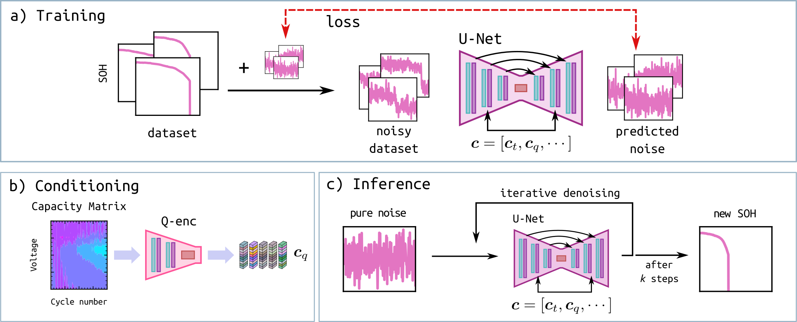

# DiffBatt: Battery Degradation Prediction and Synthesis with Diffusion Models

**Introduction**
================

Battery degradation remains a critical challenge in the pursuit of green technologies and sustainable energy solutions. Despite significant research efforts, predicting battery capacity loss accurately remains a formidable task due to its complex nature, influenced by both aging and cycling behaviors. To address this challenge, we introduce DiffBatt, a novel general-purpose model for battery degradation prediction and synthesis.



**Project Description**
------------------------

DiffBatt is a novel general-purpose model for battery degradation prediction and synthesis. It leverages diffusion models with classifier-free guidance and transformer architecture to achieve high expressivity and scalability. DiffBatt operates as a probabilistic model to capture uncertainty in aging behaviors and a generative model to simulate battery degradation.

**Features**
------------
*   **Classifier-Free Guidance**: DiffBatt uses classifier-free guidance, which combines conditional and unconditional diffusion models, to generate high-quality degradation curves, making it a powerful tool for predicting battery capacity loss.
*   **Probabilistic Modeling**: DiffBatt captures uncertainty in aging behaviors, allowing it to provide accurate predictions even in situations with high levels of variability.
*   **Generative Modeling**: DiffBatt can simulate battery degradation, enabling the generation of synthetic degradation curves that can be used for enhanced model training and data augmentation.
*   **Transformer Architecture**: The model uses transformer architecture for attention-based processing of the input capacity matrix.
*   **Superior Generalizability**: DiffBatt demonstrated superior generalizability in the remaining useful life prediction task, outperforming all other models with a mean RMSE of 196 across all datasets.
*   **Flexibility as a Foundation Model**: Once trained on large datasets, DiffBatt can serve as a foundation model that can be fine-tuned for specific tasks or domains, making it a versatile tool for various battery degradation prediction and synthesis applications.

**Model Architecture**
=====================

The `DiffBatt` model is built using a customized U-Net architecture, which consists of several key components:

<!-- *   **DownBlock**: The DownBlock component uses a series of residual blocks with convolutional and attention modules to progressively downsample the input data. Each block has two branches: one for the feature extraction and another for the attention computation.
*   **MiddleBlock**: The MiddleBlock is the core component of the model, which consists of three residual blocks. This part of the network processes the input data using a combination of convolutional and attention modules to capture complex features.
*   **UpBlock**: The UpBlock component uses a series of residual blocks with transposed convolutions and attention modules to progressively upsample the feature maps. Each block has two branches: one for the feature extraction and another for the attention computation.

Let's dive into a detailed discussion of the U-Net model architecture in `unet.py`.

**Build Model**

The `build_model` function defines the overall structure of the U-Net model. It takes various hyperparameters as inputs, such as `widths`, `num_res_blocks`, `has_attention`, and others. -->

**Down-sampling Blocks**

The down-sampling blocks are a series of encoding layers that progressively reduce the spatial resolution of the input data while increasing its depth. Each down-sampling block consists of two residual blocks with attention and pooling operations. The architecture can be broken down as follows:

*   Two residual blocks: These blocks take the output from the previous layer and perform transformations using `ResidualBlock_Down`. This is followed by a normalization operation using `GroupNormalization`.
*   Attention block: If specified, an attention block is applied to the output of the residual blocks. This allows the model to focus on specific features or patterns in the data.
*   Down-sampling: The output from the previous layer is down-scaled using `DownSample` to reduce the spatial resolution.

**Middle Block**

The middle block serves as an intermediate processing stage between the down-scaling and up-scaling operations. Its architecture consists of two residual blocks with attention. These blocks process the output from the previous layer, applying residual transformations with attention.

**Up-sampling Blocks**

The up-sampling blocks are responsible for up-scaling the feature maps and performing refinement operations. Each up-sampling block consists of:

*   Three residual blocks with attention: These blocks process the output from the previous layer, applying residual transformations with attention.
*   Up-sampling: The output is up-scaled using `UpSample` to increase the spatial resolution with transposed convolutions.
*   Skips and Concatenation: In each up-sampling block, the output from the corresponding down-sampling block is retrieved and concatenated with the current feature map, and then passed through a residual block.

**Additional Components**

The model utilizes several other components:

*   `TimeMLP`: Processes time embedding using a multilayer perceptron (MLP).
*   `TransformerEncoder`: Embeds the capacity matrix using a transformer encoder.
*   `PositionalEncoding1D`: Adds information about cycle life to the diffusion process using positional encoding.

**Residual Blocks for Down-sampling**

The `ResidualBlock_Down` function defines a residual block architecture specifically designed for down-scaling operations. Its primary goal is to progressively reduce the spatial resolution of the input data while increasing its depth. Here's a breakdown of its components:

1.  **Normalization and activation**: The input undergoes group normalization followed by application of an activation function.
2.  **Convolutional layer**: A convolutional layer with kernel size 3, zero padding and width equal to the specified `width` is applied.
3.  **Temporal embedding processing and conditioning**: The temporal embedding ($\mathbf{c}_t$) is processed by applying an activation function followed by a dense layer with output shape `(width,)`. This processed $\mathbf{c}_t$ is then added to the convolutional output $\mathbf{x}$
$$
\mathbf{y} = \mathbf{x} + \mathbf{c}_t.
$$
4.  **Normalization and activation**: The resulting output from the concatenation undergoes group normalization, application of an activation function, and another convolutional layer with kernel size 3, zero padding and width equal to the specified `width`.
5.  **Shortcut connection creation**: A shortcut connection (residual) is created by adding the output from the last convolutional layer with the residual (input) after it has passed through a convolutional layer with kernel size 1.

**Residual Blocks for Up-sampling**

The `ResidualBlock_Up` function defines a residual block architecture specifically designed for up-scaling operations. Its primary goal is to progressively increase the spatial resolution of the input data while decreasing its depth. Here's a breakdown of its components:

1.  **Normalization and activation**: The input undergoes group normalization followed by application of an activation function.
2.  **Convolutional layer**: A convolutional layer with kernel size 3, zero padding and width equal to the specified `width` is applied.
3.  **Temporal embedding processing**: The temporal embedding ($\mathbf{c}_t$) is processed by applying an activation function followed by a dense layer with output shape `(width,)`. This processed $\mathbf{c}_t$ is then concatenated with the convolutional output using an additive operation (`keras.layers.Add()`).
4.  **Capacity-matrix embedding processing**: The capacity-matrix embedding ($\mathbf{c}_q$) is also processed in the same way as the temporal embedding.
5.  **Conditioning and normalization**: This step is performed by multiplying the capacity-matrix embedding with the convolutional output $\mathbf{x}$ and adding the time embedding $\mathbf{c}_t$, followed by group normalization and application of an activation function.
$$
\mathbf{y} = \mathbf{c}_q \times \mathbf{x} + \mathbf{c}_t.
$$ 
6.  **Normalization and activation**: The resulting output from the previous layer undergoes group normalization and application of an activation function, followed by another convolutional layer with kernel size 3, zero padding and width equal to the specified `width`.
7.  **Shortcut connection creation**: A shortcut connection (residual) is created by adding the output from the last convolutional layer with the residual (input) after it has passed through a convolutional layer with kernel size 1.

The primary differences between these two residual blocks lie in how they are conditioned with temporal and capacity-matrix embeddings.

<!-- **Key Model Components**
------------------------

The `DiffBatt` model consists of several key components:

*   **Residual Blocks**: These blocks use convolutional and attention modules to capture complex features in the input data.
*   **Attention Modules**: These modules selectively update certain features based on the given conditions, enabling the model to learn complex relationships between different features.
*   **Transposed Convolutions**: These are used in the UpBlock component to progressively upsample the feature maps while preserving spatial information.
*   **PositionalEncoding1D**: This module applies a sinusoidal positional encoding to the input data, which helps capture temporal relationships and structure. It uses a combination of sine and cosine functions intertwined to produce a positional encoding matrix.

*   **Time Embedding**: The `TimeEmbedding` component is used to embed the time dimension of the input data into a learnable representation. This module applies a sinusoidal positional encoding to the input data, which helps capture temporal relationships and structure.  -->

**Transformer Encoder**
---------------------

The TransformerEncoder is a critical component of the `DiffBatt` model, which is used to encode the capacity matrix. This encoder uses a combination of attention mechanisms and dense layers to capture complex relationships between different features in the capacity matrix.

Here's a detailed breakdown of the TransformerEncoder architecture:

*   **Dense Layer**: The input data is passed through a dense layer with `units` number of neurons.
*   **Attention Block**: The output of the dense layer is then passed through an attention block, which selectively updates certain features based on their relevance. This block uses a weighted sum of the input features to compute the attention weights.
*   **Global Average Pooling**: The output of the attention block is then passed through a global average pooling layer to reduce the spatial dimensions of the feature maps.
*   **Final Dense Layer**: The output of the previous layers is then passed through another dense layer with `units` number of neurons.

The TransformerEncoder architecture can be represented as follows:

```text
Transformer Encoder:
  +-----------+
  |  Dense    |
  +-----------+
           |
           |  Attention Block
           v
  +-----------+-----------+
  | Global Avg Pooling    |
  +-----------+-----------+
           |
           |  Final Dense 
           v
  +-----------+
  | Output    |
  +-----------+
```

This architecture allows the model to capture complex relationships between different features in the capacity matrix, which is essential for making accurate predictions.

**File and Folder Structure**
=============================

The project consists of the following files and folders:

*   `unet.py`: This file contains the implementation of the customized DDPM architecture.
*   `gaussian_diffusion.py` and `diffusion_model.py`: These files contain the implementations of the Gaussian diffusion process and the diffusion model, respectively.
*   `testing.py`: This file contains a script for testing the trained model on a separate test set.
*   `trained_models/`: This folder contains pre-trained models for various battery datasets.
*   `data/`: This folder contains the pre-processed dataset used for training and testing the models.

**Getting Started**
===================

To get started with the project, follow these steps:

1. Clone the repository: `git clone https://github.com/***/diffbatt.git`
2. Install required dependencies: `pip install -r requirements.txt`
3. Train the model using the provided script (e.g., `python training.py`)

**Requirements**
----------------
* NumPy 1.*
* TensorFlow 2.14.0

**Contributing**
----------------

We welcome contributions to the project! If you'd like to contribute, please fork the repository and submit a pull request with your changes.


